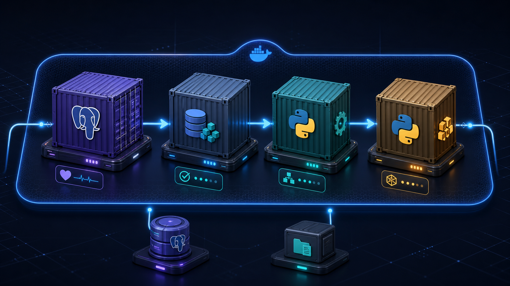

# Running the project with Docker



The Docker setup runs PostgreSQL and the local Airflow environment. Airflow now
owns the normal pipeline execution; the original one-container-per-stage path
is still available through the `manual` profile.

```text
postgres -> seed-oltp -> oltp-to-vault -> vault-to-galaxy
```

I kept both paths because they are useful for learning different jobs:
Compose manages services, while Airflow manages task runs.

## What Compose starts

- `postgres` runs PostgreSQL 17 and stays available after the pipeline finishes.
- `seed-oltp` runs `DDL/populate.py` and creates the sample operational data.
- `oltp-to-vault` runs the first ETL.
- `vault-to-galaxy` runs the dimensional ETL.
- `airflow-db` stores only Airflow metadata.
- `airflow-api-server` serves the UI and API on port 8080.
- `airflow-scheduler` schedules and executes local tasks.
- `airflow-dag-processor` parses the DAG files.
- `airflow-init` applies metadata database migrations and exits.

The three manual Python jobs share the same `ons-etl:local` image. Airflow uses
`ons-airflow:3.3.1`, which extends the official image with this project's code.

In the manual profile, Compose waits for PostgreSQL to become healthy before
loading data. Each job starts only if the previous one exits successfully.
Seeing the three Python containers as `Exited (0)` is therefore the expected
result, not an error.

## Before the first run

Create your local environment file:

```powershell
Copy-Item .env.example .env
```

Using Bash:

```bash
cp .env.example .env
```

Open `.env` and replace the example passwords. This file stays local and should
never be committed.

Airflow also requires `AIRFLOW_FERNET_KEY` and `AIRFLOW_API_JWT_SECRET` before
Compose can resolve the stack. Generate them with the commands in
[`airflow.md`](airflow.md#preparing-env).

The project database uses three separate accounts on purpose:

- `POSTGRES_ADMIN_USER` initializes PostgreSQL.
- `OLTP_USER` can load the operational tables.
- `DB_USER` is used by both ETLs.

The last two are non-superuser roles. The administrator password is not passed
to the Python containers.

`DOCKER_DB_HOST` should remain `postgres`, which is the database service name
inside the Compose network. `DB_HOST` and `DB_PORT` are still useful when
running Python directly from the host.

## What happens to the database

The first time PostgreSQL starts with an empty `postgres-data` volume, it runs
`docker/postgres/init/10-bootstrap.sh`. That script creates the application
roles, applies the DDL, and grants the permissions needed by each job.

The DDL order is:

1. `DDL/oltp.sql`
2. `DDL/datavault.sql`
3. `DDL/fact_constelation.sql`
4. `DDL/etl.sql`

This bootstrap runs only for an empty database volume. If a DDL or permission
change does not appear after restarting the containers, the existing volume is
usually the reason.

## Running the pipeline

From the repository root:

```bash
docker compose config --quiet
docker compose up --build airflow-init
docker compose up -d
```

Open Airflow at `http://localhost:8080` and run
`ons_enterprise_data_pipeline`. Secret generation, login, and DAG operation are
covered in [`airflow.md`](airflow.md).

Check the final state with:

```bash
docker compose ps --all
```

The successful service state is two healthy PostgreSQL containers plus a
healthy API server, scheduler, and DAG processor. `airflow-init` should show
exit code `0`.

Run the original Compose-only pipeline when you want to compare the approaches:

```bash
docker compose --profile manual up --build \
  seed-oltp oltp-to-vault vault-to-galaxy
```

## Useful commands

Run the jobs again against the existing database:

```bash
docker compose --profile manual up \
  seed-oltp oltp-to-vault vault-to-galaxy
```

The data generator uses stable business keys and ignores rows that already
exist. The ETLs can also be run again without duplicating their results.

Stop the stack without deleting the database or logs:

```bash
docker compose down
```

Start from a completely empty database:

```bash
docker compose down --volumes
```

Be careful with the last command. It permanently removes both PostgreSQL
databases, the generated Airflow login, and all persisted runtime logs.

## Connecting from the host

Use `localhost`, the value of `POSTGRES_PORT`, and the database name configured
in `DB_NAME`. Containers inside the network use `postgres:5432` instead.

If the host port is already taken, change `POSTGRES_PORT` in `.env`. There is no
need to change the internal port.

## Files involved

- `Dockerfile` builds the Python image used by the three manual jobs.
- `Dockerfile.airflow` builds the Airflow image used by the scheduler and UI.
- `compose.yaml` connects the services and controls their order.
- `.env.example` lists the local configuration without real secrets.
- `.dockerignore` keeps secrets, caches, tests, and local files out of the image.
- `docker/postgres/init/10-bootstrap.sh` prepares PostgreSQL on its first start.
- `DDL/` contains both the schemas and the synthetic data generator.
- `airflow/` contains the DAG, stage runner, and Airflow-only requirements.

The configuration has been checked without Docker, and the Python tests pass.
The image builds and the first end-to-end Airflow run still need to be done on
a machine with Docker installed.
